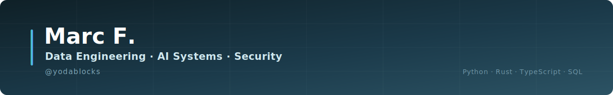

**I build real-time data pipelines, AI/LLM systems, and security tooling for high-stakes, high-throughput environments.**

7+ years shipping production systems across data engineering, applied ML/LLM infrastructure, and security — with deep experience in low-latency ingestion, multi-source data reconciliation, and systems that have to be right under load. Most of this was built for blockchain and market-data environments, which forced a level of correctness and latency discipline that's directly transferable to any data-intensive or AI system.

---

## 🛠️ Data engineering & pipelines

- **reth-usdc-indexer** — Real-time data indexer with zero external API calls, sub-10ms query latency, and automatic handling of out-of-order/conflicting events (reorg handling).
- **perp-liquidity** — Multi-source data aggregation tool unifying 8 independent feeds (orderbook, funding, open interest, liquidations) into one consistent view. 138 tests.
- **depth-map** — Cross-source data reconciliation engine computing depth and cost-to-move across 5 sources, including custom adapters for two exchanges with non-standard APIs.
- **signal-pipeline** — Source-agnostic ingestion layer with trust-tier weighting and statistical anomaly detection (MAD-based outlier filtering). 44 tests.
- **hip3-divergence** — Real-time divergence monitor reconciling three independent price sources, flagging drift as it happens. 42 tests, runs 24/7 unattended on a Raspberry Pi.
- **defi-replay-kit** — Pre-packaged exploit/incident datasets, offline-queryable via SQL, used for forensic research and audits.
- **yulsafe** — Gas-optimized vault contract (ERC4626) for zkSync Era.

## 🤖 AI / LLM systems

- **Quarq** — RAG-based research and report assistant: document ingestion, retrieval, and LLM-driven report generation pipeline.
- **CyberShield** — Threat detection platform with a three-tier decision pipeline (rule engine → ML classifier → LLM fallback for ambiguous cases), plus a browser extension doing real-time DOM analysis.
- **rsentinel** — Hardening and detection tooling for AI/agent infrastructure: prompt injection detection, tool-abuse monitoring, session integrity checks. Also a general-purpose Rust CLI security scanner (SSL/TLS, HTTP headers, DNS).

## 🔐 Security engineering

- **cve-guard** — Dependency vulnerability scanner with live CVE database integration.
- **rsentinel** — *(see above)* — also functions as a standalone infra scanner.
- Server hardening, VPN tunneling (WireGuard), and access-control audits on self-managed infrastructure.

## 📊 Analytics & SDKs

- **VLTFI / RiskLens** — Risk intelligence engine: cross-source concentration mapping, exposure analysis, institutional-grade reporting.
- **cac40-portfolio-analyser** — Portfolio analysis tool for CAC40 equities.
- **grvt-sdk** — Python SDK for an exchange API: REST, WebSocket, cryptographic request signing, low-latency order pipeline. 83 unit tests.
- **cohort-pnl / cohort-dashboard** — Cohort analytics by performance tier, with per-entity drill-down.
- Merged open-source contributions: threaded WebSocket client for an exchange SDK ([paradex-py](#)), two merged PRs on a public analytics CLI ([nansen-cli](#)), Dune Spellbook contributor.

---

| | |
|---|---|
| **Languages** | Python · Rust · TypeScript · SQL |
| **Infra** | Reth · zkSync · BigQuery · Tailscale · Nginx |
| **Domains applied in** | Blockchain data & DeFi protocols, market microstructure, security tooling |
| **Spoken** | French (native) · English · Mandarin |

---

**Based in Taipei** &nbsp;·&nbsp; Open to Data Engineering & AI Engineering roles (remote, Singapore, HK, Europe)

