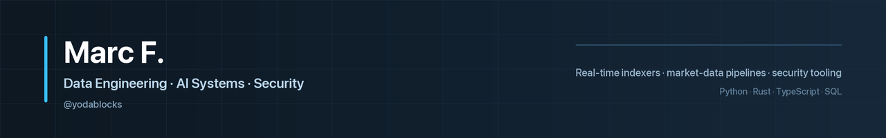

**I build real-time data pipelines, AI/LLM systems, and security tooling for high-stakes, high-throughput environments.**

7+ years shipping production systems across data engineering, applied ML/LLM infrastructure, and security, with deep experience in low-latency ingestion, multi-source data reconciliation, and systems that have to be right under load. Most of this was built for blockchain and market-data environments, which forced a level of correctness and latency discipline that's directly transferable to any data-intensive or AI system.

---

## ⚙️ Backend & workflow engines

- **[keel](https://github.com/yodablocks/keel)**. Durable execution engine for AI agents, in TypeScript on Postgres: steps that survive a `SIGKILL` mid-run, retries driven by *why* a step failed, per-run and per-tenant budgets that defer runs instead of failing them, and human approval as a first-class step. Jev classifies failures from their messages (29/30 against 14/30 for status-code rules, on a synthetic set the README calls too easy). Its own benchmark found its bottleneck, a hot spend row, fixed by sharding: ~2,000 runs/s at 32 workers. Zero-dependency dashboard, serverless mode, 95 tests.

## 🛠️ Data engineering & pipelines

- **reth-usdc-indexer**. Real-time indexer running *inside* the node as an execution extension: zero external API calls, ~2 µs mean balance lookups (p99 under 3 µs, benchmark included), and exact rollback on out-of-order/conflicting events (reorg handling). [Public version with reproducible benchmark →](https://github.com/yodablocks/reth-usdc-indexer-public)
- **perp-liquidity**. Multi-source data aggregation tool unifying 8 independent feeds (orderbook, funding, open interest, liquidations) into one consistent view. 138 tests.
- **depth-map**. Cross-source data reconciliation engine computing depth and cost-to-move across 5 sources, including custom adapters for two exchanges with non-standard APIs.
- **signal-pipeline**. Source-agnostic ingestion layer with trust-tier weighting and statistical anomaly detection (MAD-based outlier filtering). 44 tests.
- **hip3-divergence**. Real-time divergence monitor reconciling three independent price sources, flagging drift as it happens. 42 tests, runs 24/7 unattended on a Raspberry Pi.
- **defi-replay-kit**. Pre-packaged exploit/incident datasets, offline-queryable via SQL, used for forensic research and audits.
- **yulsafe**. Gas-optimized vault contract (ERC4626) for zkSync Era.

## 🤖 AI / LLM systems

**Four public repos on TypeSafe's Jev**, a decision model released 14 Sep 2026. They cross-reference each other, and each one publishes what it gets wrong:

- **[jev-orderby-bench](https://github.com/yodablocks/jev-orderby-bench)**. Independent calibration and ranking benchmark: pre-registered gates, Brier and ECE, invariant checks, and a graded-relevance probe the model fails four of six times. It also measured that batching 40 rows per request fails the ranking gate that one row per request passes, which then decided the architecture of two repos below. Vendor claims measured, not assumed.
- **[commitjev](https://github.com/yodablocks/commitjev)**. Reviews a commit before a human does: whether the message matches the diff, whether the edits belong together, what the message leaves out. Eight Nouls and a Choice in one request, every threshold owned by code. Ships a calibration harness of labelled defects that reports its own margins, false alarms and run-to-run variance. 27 tests. Running it on its own history found four bugs in it, including a rule that scored *below chance*, all documented in the README rather than quietly fixed.
- **[jevq](https://github.com/yodablocks/jevq)**. Static linter for the questions you ask a decision model: nine rules encoding the vendor's own documented failure modes, no API call, runs in 0.03s. Four projects in that ecosystem are linters *powered by* Jev; none checked the questions themselves. It catches the below-chance bug above instantly. 21 tests.
- **[jobbyjev](https://github.com/yodablocks/jobbyjev)**. Ranks companies by interview likelihood for one resume. States plainly which direction it must not be run in and why, and ships its dataset's provenance inside the data file rather than only in the README.
- **[keel](https://github.com/yodablocks/keel)** *(see above)*. Uses Jev as the failure classifier behind its retry policy, with a rule-based fallback when Jev is unsure or unavailable.
- **duckdb-jev**. Semantic `ORDER BY` for DuckDB backed by that model, shipped with its own calibration numbers.
- **[quarq](https://github.com/yodablocks/quarq)**. Portfolio analytics and cited research over French and EU regulatory documents (ECB, Banque de France, AMF), running on a local LLM. Retrieval is measured, not assumed: a human-reviewed 28-question gold set puts the right page in the top 5 for 25 of 28, and every eval run compares the vector index with exact search. That check caught ChromaDB leaving true neighbours out on 7 of 28 questions, traced to HNSW settings that only apply when a collection is created, and fixed by rebuilding the index without re-embedding (0 of 28). A corpus manifest records each document's period and publication date, because a PDF's metadata dates the file, not the edition. Alpha, not yet used in production. 195 tests.
- **CyberShield**. *(early stage)* Multi-tenant threat-detection platform: FastAPI service, Postgres schema and Alembic migrations in place. Detection pipeline is designed, not yet implemented.
- **rsentinel**. Defensive posture scanner in Rust: TLS, HTTP headers, DNS (SPF/DMARC/DKIM/DNSSEC), CORS and exposure checks behind one CLI. CVSS-derived severity, SARIF 2.1.0 output for GitHub code scanning, 161 tests. [Public repo →](https://github.com/yodablocks/rsentinel-public)

## 🔐 Security engineering

- **cve-guard**. Dependency vulnerability scanner for Node.js projects: live OSV.dev and NVD lookups, monorepo-aware scanning, AI-generated fix PRs, Slack alerts and PDF/CSV reporting. Next.js, 24 API routes, ~12k lines.
- **rsentinel** *(see above)*. Eight scanner modules, machine-readable output, runs unauthenticated from an external perspective.
- Server hardening, VPN tunneling (WireGuard), and access-control audits on self-managed infrastructure.

## 📊 Analytics & SDKs

- **VLTFI / RiskLens**. Risk intelligence engine: cross-source concentration mapping, exposure analysis, institutional-grade reporting.
- **cac40-portfolio-analyser**. Portfolio analysis tool for CAC40 equities.
- **grvt-sdk**. Python SDK for an exchange API: REST, WebSocket, cryptographic request signing, low-latency order pipeline. 83 unit tests.
- **cohort-pnl / cohort-dashboard**. Cohort analytics by performance tier, with per-entity drill-down.
- Open-source contributions: packaging fix merged into a public analytics CLI ([nansen-cli #294](https://github.com/nansen-ai/nansen-cli/pull/294)); [jev-orderby-bench](https://github.com/yodablocks/jev-orderby-bench) added to three curated TypeSafe/Jev indexes via merged PRs, and four repos published into that ecosystem in its first week; threaded WebSocket client submitted to an exchange SDK ([paradex-py #121](https://github.com/tradeparadex/paradex-py/pull/121)).

---

| | |
|---|---|
| **Languages** | Python · Rust · TypeScript · SQL |
| **Infra** | Postgres · Docker · GitHub Actions · Reth · zkSync · BigQuery · Tailscale · Nginx |
| **Domains applied in** | Blockchain data & DeFi protocols, market microstructure, security tooling |
| **Spoken** | French (native) · English · Mandarin |

---

**Based in Taipei** &nbsp;·&nbsp; Open to Backend, Data Engineering & AI Engineering roles (remote, Singapore, HK, Europe)

